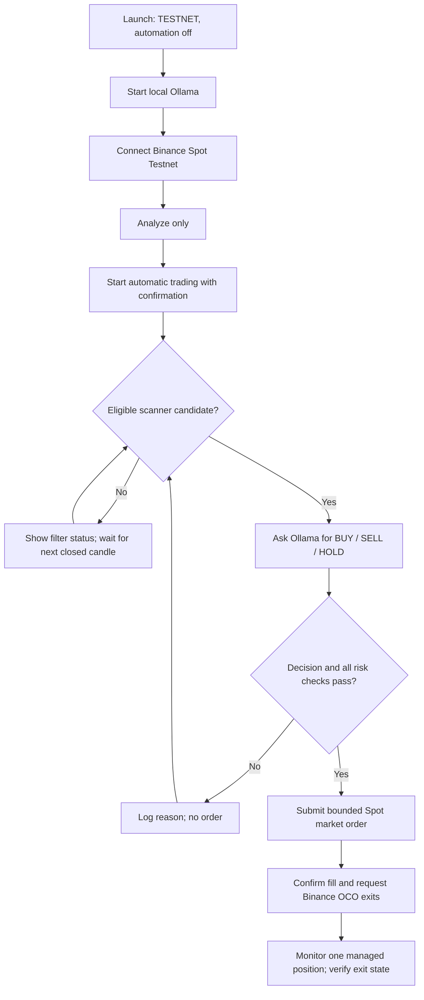

# Astra AI Trader — Setup and User Guide

This guide covers installing the Windows desktop app, preparing local AI,
connecting Binance Spot Testnet, understanding the dashboard, and operating
the optional LIVE mode. Read the risk and scope sections before connecting an
account.

## 1. Important safety and scope

- Begin with **TESTNET**. Testnet orders use simulated funds; they do not prove
  that a strategy will be profitable in production.
- LIVE mode sends real Binance Spot market orders. You can lose the money in
  your account. Neither the AI nor the app guarantees a profit or a fill price.
- This app implements Binance **Spot** only. It does not place Margin or
  Futures orders.
- Do not use an API key you do not own or are not authorized to use. Never
  share an API key, secret, recovery code, or unredacted account screenshot.
- Do not enable withdrawals on an API key used by this app. Restrict any LIVE
  key to a trusted IP address and give it only the permissions required by
  Binance and the app.
- Keep the app, Ollama, and API credentials on a Windows account you control.
  The app's optional saved credentials are protected with Windows DPAPI for
  the current Windows user; that is not protection against malware or a
  compromised Windows account.
- A Binance stop/target trigger is not a guaranteed execution price. A gap,
  outage, rejection, or slippage can cause a different result or a loss.

## 2. What you need

### Run the source on Windows

- Windows 10 or Windows 11.
- Python 3.10 or later with Tcl/Tk included. Check with `python --version`;
  `python -m tkinter` should open a small Tk window.
- Internet access for Binance public market data and local model download.
- Ollama installed locally and the configured model downloaded. The default
  `qwen2.5:3b` model download is roughly 2 GB; allow additional disk space.
- A Binance Spot Testnet account for simulated trading. LIVE mode additionally
  requires an authorized production Binance account and a carefully restricted
  API key.

The app's Python modules use the standard library. The source run does not
require a separate `pip install` step.

### Downloaded Windows executable

If a Windows executable is published under the GitHub **Releases** tab, save
it from the release page and follow that release's notes. The executable is
not code-signed; Windows SmartScreen may show an unknown-publisher warning.
Only run a binary obtained from the repository owner's official release page
that you trust. Ollama and the AI model are separate downloads.

## 3. Install and start Ollama

1. Install Ollama for Windows from [ollama.com](https://ollama.com/download).
2. Open PowerShell and download the default model:

   ```powershell
   ollama pull qwen2.5:3b
   ```

3. Start Ollama if it is not already running:

   ```powershell
   ollama serve
   ```

   Leave this terminal open if Ollama is running in the foreground. Some
   Ollama installations start the local service automatically.

4. Confirm the local service responds:

   ```powershell
   Invoke-RestMethod http://127.0.0.1:11434/api/tags
   ```

The application only accepts a local Ollama endpoint. Ollama model inference
can be slow on first use while the model loads; wait for completion. No API
credentials are sent to Ollama.

## 4. Start the app

### From a downloaded source folder

Open PowerShell in the project directory:

```powershell
python --version
python -m tkinter
python .\app.py
```

Close the small Tk test window before launching the app. No Binance order is
placed just by opening the application.

### From the published executable

Run `AstraAITrader.exe` from the official GitHub release download. On first
start, Windows may ask you to confirm that you trust the unsigned executable.
Do not run it if its source is unclear.

### First-launch data and credentials

The application stores its local ledger and optional saved credentials below:

```text
%LOCALAPPDATA%\AstraAITrader
```

These files are private account/trading state, not project files. Never upload
them to GitHub or attach them to a support request. The default mode is
**TESTNET**; automation starts **off**.

## 5. Create Testnet credentials and connect

1. Open the Binance Spot Test Network at
   [testnet.binance.vision](https://testnet.binance.vision/).
2. Sign in or create a Testnet account using the options shown by Binance.
   Generate API credentials in the Testnet portal.
3. In Astra AI Trader, keep the mode set to **TESTNET**. Enter the Testnet API
   key and secret into the Testnet fields. Do not paste them into chat, a
   screenshot, a GitHub issue, or a source file.
4. Select **Connect Binance account**. The app checks the connection and shows
   account/balance information. If this fails, confirm the key belongs to
   Spot Testnet, that Ollama setup is separate from the Binance connection,
   and that the key was copied correctly.
5. The **Remember last connected keys** option is enabled by default. It saves
   the last successfully connected credentials using Windows DPAPI for the
   current Windows user. Uncheck it not to save them, or choose **Forget saved
   keys** to remove the saved copy.

Testnet and production credentials are separate. Do not put a production key
in the Testnet fields or a Testnet key in the LIVE fields.

## 6. Learn the dashboard before automating

The main window has two tabs: **Dashboard** and **Connection & Activity**.
The top toolbar remains visible above the tabs.



### Top actions

- **Connect Binance account** checks the selected environment and refreshes
  account information. It does not place an order.
- **Analyze only** fetches market candles and asks the local model for an
  assessment. This is a preview and does not place an order.
- **Start automatic trading** asks for confirmation, then starts the selected
  automatic mode. It is intentionally off after launch.
- **Pause bot** stops later automation cycles. It does not cancel exchange
  exits that have already been placed on Binance.
- **Reconcile pending order** is for an order with an uncertain result. Follow
  the Activity message and verify the exchange state; do not submit another
  order while reconciliation is pending.
- **Confirm no order exists** is a recovery action only after you personally
  confirm on Binance that the pending order does not exist. Do not use it to
  dismiss an unknown outcome.
- **Desktop alerts** toggles notifications; alerts do not place or cancel
  orders.

### Market, chart, and scanner

- The chart's symbol selector (default `BTCUSDT`) and chart interval are for
  the chart and **Analyze only**. Automatic mode scans its own market universe
  and can trade a different symbol.
- **Refresh chart** fetches chart data. **Backtest** runs a historical
  simulation only; it never sends orders and does not replay historical
  Ollama decisions.
- **Live prices · ~1 sec** refreshes displayed prices, the chart's forming
  candle, scanner prices, and estimated open-position P/L. It is display-only:
  the AI is not making decisions every second, and this setting does not poll
  balances every second.
- The automatic scanner reviews up to the 20 highest-24-hour-quote-volume
  eligible USDT Spot pairs; its universe refreshes about every 15 minutes.
  It requires a closed-candle uptrend, RSI14 from 40 through 68, and positive
  three-candle momentum before a pair is eligible. It sends only its top
  eligible technical candidate to Ollama.
- **TECH SCORE** is a ranking score, not a probability or expected return.
  Filter status explains why a pair did not pass.

### AI and order decisions

Automatic signals use the configured closed-candle timeframe, default **15m**.
The available intervals are 1m, 5m, 15m, 1h, and 4h. The bot waits for a newly
closed candle before analysis; network calls and Ollama inference add delay.
One-minute candles therefore do not mean one-second decision-making.

The local model receives technical indicators and returns BUY, SELL, or HOLD.
Its displayed confidence is model-reported and **not calibrated**; it is not
the chance of a profitable trade. A BUY must still pass the app's confidence,
technical, balance, exchange-filter, position, and risk checks. HOLD means the
app sends no entry. A SELL signal cannot sell an arbitrary wallet balance:
the app only sells a bot-managed position.

If no scanner rows pass the technical filters, the bot waits for the next
closed-candle cycle and sends no AI request or entry order. If the model
recommends HOLD, there is also no order. This is expected safety behavior,
not proof that the exchange rejected an order.

Only one bot-managed position is supported at a time. While that position is
open, new scanner entries are paused and the bot monitors/manages that
position.

## 7. Set up and run TESTNET automation

Before starting:

1. Confirm **TESTNET** is selected in the toolbar.
2. Connect the Testnet account and verify balances.
3. In **Connection & Activity**, set the per-trade maximum buy amount, drawdown
   stop, stop-loss percentage, take-profit percentage, and automatic
   timeframe. The displayed defaults are examples, not recommendations.
4. Confirm that Ollama is running and that the configured model name (default
   `qwen2.5:3b`) is installed.
5. Read the dashboard scanner status and use **Analyze only** to verify the
   AI response before testing automation.
6. Select **Start automatic trading** and confirm the Testnet prompt.

The bot uses simulated Spot funds and automatic market orders. After a buy
fill, it attempts to place Binance exchange-managed OCO stop/target exits for
the tracked position. Verify the exit status in the dashboard and on the
Testnet account. Testnet availability, symbols, market activity, fills, and
filters can differ from production.

An automation cycle can correctly finish with no order because there is no
eligible candidate, the model chose HOLD, confidence was below the gate,
there is not a new closed candle, the bot is already managing a position, or
a safety check stopped execution. Read the complete **Activity** entry for
the reason.

## 8. Positions, exits, and recovery

- The open-position table reports estimated **gross** unrealized P/L; fees
  are excluded.
- Binance-hosted OCO exits may trigger while the desktop app is paused or
  closed. Pausing the bot does not cancel those orders.
- **Verify exits** asks Binance for the recorded exit-list and child-order
  states.
- **Protect open position** requests exits only when a managed position is
  recorded as unprotected. It is not a general-purpose order-placement button.
- **Close managed position** first cancels and verifies the bot-managed exit
  list, then sells only the tracked available quantity after confirmation.
- If an order submission result is ambiguous, automation halts and marks the
  order for reconciliation. Check Binance order history before resolving it.
  Never manually erase or edit the ledger to bypass this state.
- The bot's drawdown stop halts future automation orders; it does not
  automatically sell an open position.

## 9. LIVE mode — real funds

Only proceed after substantial Testnet/forward testing, understanding the
strategy and exchange risks, and confirming the app is lawful and authorized
for your account and region. No profitability evidence is provided.

1. Create a dedicated production API key on Binance. Do not reuse a key from
   another application.
2. Use the minimum permissions Binance requires for account reading and Spot
   trading. **Disable withdrawals** and enable a trusted IP restriction.
   Binance may combine Spot and Margin permission flags; this app calls Spot
   endpoints only but cannot certify that the key is Spot-only elsewhere.
3. Keep the API key and secret out of source code, environment files,
   screenshots, chat, logs, and GitHub. Enter them only into the app's LIVE
   fields. A read-only key can connect for inspection but cannot place orders.
4. Select **LIVE**, connect the account, inspect all nonzero balances, and
   configure a per-trade buy cap and daily peak-to-current account-equity
   drawdown stop in USDT. The fields are blank when switching to LIVE until
   you set valid values. The daily limit must be below observed starting
   equity.
5. Check balances can be valued. An unsupported asset or failed valuation
   blocks LIVE orders.
6. Start automation only when ready. LIVE requires a warning confirmation and
   typing exactly `LIVE` on every run.

LIVE mode has explicit order caps and risk gates, but they cannot ensure
execution at a target price, prevent losses, or protect against every outage
or exchange failure. At the drawdown limit, the bot stops new orders and
leaves any open position and its exchange exits untouched. Do not use funds
you cannot afford to lose.

## 10. Activity messages and common troubleshooting

| Message or symptom | What it means / what to check |
| --- | --- |
| `0 passed the technical filters` / no candidate | No scanned pair met all closed-candle trend, RSI, and momentum conditions. Wait for a later cycle; do not weaken LIVE safeguards just to force an entry. |
| `AI recommends HOLD` | Ollama reviewed the eligible candidate but did not recommend an entry. No order is expected. |
| Model confidence below 80% | A BUY/SELL signal did not meet the current minimum confidence gate. The model's confidence is not a calibrated probability. |
| No new closed candle | The bot already analyzed the latest candle or is waiting for the selected timeframe boundary. |
| Cannot reach local Ollama | Start Ollama, verify `http://127.0.0.1:11434/api/tags`, and install the model with `ollama pull qwen2.5:3b`. |
| Unsupported Ollama response | Confirm the configured local model is available; inspect the Activity error and retry after Ollama is healthy. |
| Insufficient balance / below minimum notional | Check the selected environment's free quote balance and Binance pair filters. The configured order cap cannot override exchange minimums. |
| Position needs attention / exits unknown | Do not start automation. Use **Verify exits** and follow the explicit recovery message; inspect the Binance order list if needed. |
| LIVE permission or equity valuation blocked | Check API trading/read permissions, withdrawals disabled, IP restrictions, account eligibility, and whether every nonzero asset can be valued. Do not share IP allowlists or API credentials. |
| Order result is unknown | Stop and reconcile against Binance order history before permitting another order. Do not assume the order failed. |

When asking for help, share only the relevant redacted Activity message and
whether you were on TESTNET or LIVE. Remove API keys, secrets, account IDs,
balances, IP addresses, and personal details. Never upload files from
`%LOCALAPPDATA%\AstraAITrader`.

## 11. Local data, privacy, and backup

The app stores ledgers, credential storage, and its single-instance lock under
`%LOCALAPPDATA%\AstraAITrader`. The source folder also has a private live-ledger
file in some development copies; it is deliberately excluded from Git. Do not
copy the ledger into a public repository or share it. It can contain trading
history, position state, and a hash associating the ledger with an API key.

When the app is closed, back up user data only to a location you control. Do
not delete a ledger while positions or orders may exist: doing so can make
local tracking disagree with Binance. The app does not use a Binance website
password, use Binance OAuth, or send API credentials to Ollama.

## 12. Build and test from source

Run the unit suite on Windows:

```powershell
python -m unittest discover -v -s . -p "test_*.py"
python -m py_compile app.py account_display.py backtest.py binance_permissions.py `
  binance_testnet.py credential_store.py desktop_alerts.py instance_lock.py `
  ledger_storage.py local_ai.py market_chart.py market_scanner.py trade_history.py `
  trade_ledger.py trading_engine.py test_trading.py
```

Build a standalone one-file Windows executable using the checked-in spec:

```powershell
python -m pip install --upgrade pyinstaller
python -m PyInstaller --clean --noconfirm --distpath dist --workpath build AstraAITrader.spec
```

The app executable is `dist\AstraAITrader.exe`. Do not commit `dist`, `build`,
ledgers, or account exports. For the guided installer, install Inno Setup and
follow the [installer section in README](README.md#build-the-windows-installer).

Tests mock signed order/account calls and do not prove Binance Testnet or LIVE
execution, profitability, or end-to-end installer behavior. See
[PROJECT_PLAN.md](PROJECT_PLAN.md) for remaining verification gaps.

## Screenshots

No screenshots are included in this source guide. The native desktop cannot be
captured safely from this documentation workflow; use the dashboard labels
and steps above rather than relying on an unverified or account-specific
screenshot.
